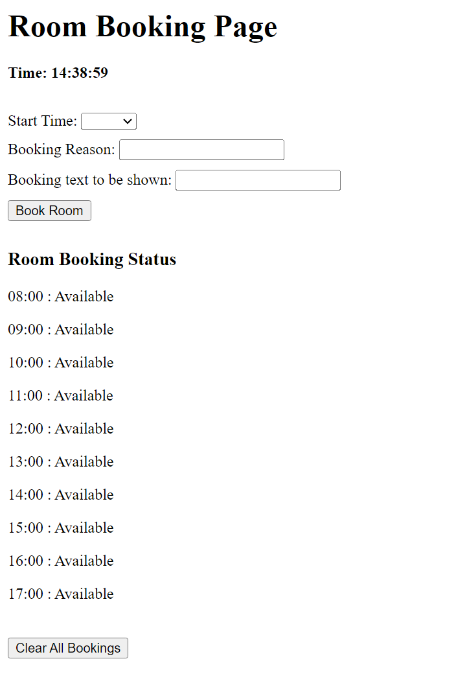

# Room Booking System

## Project Overview

This repository contains the source code for a simple Room Booking System. It allows users to book rooms for different time slots and provides information on room availability. The system is built using HTML, CSS, and JavaScript.

## Features

- **Real-time Time Display**: The web page displays the current time in real-time.
- **Room Booking**: Users can select a time slot, provide a booking reason, and a booking label, and then book the room.
- **Availability Display**: The system shows a list of time slots and their availability status.
- **Clear All Bookings**: Users can clear all bookings with a single button click.

## Code Explanation

Here are explanations for some of the key functions in the JavaScript code:

- `checkRoomBooked(time)`: This function checks if a room is booked at a given time and returns `true` if the room is booked.

- `bookRoom(time, reason, label)`: This function books a room at a given time with the specified reason and label. It prevents double bookings.

- `clearRoomBookings()`: This function clears all room bookings, resetting the system.

- `updateDisplay()`: This function updates the HTML page with a list of rooms and their availability status.

- `doBooking()`: This function is called when the "Book Room" button is clicked. It confirms the booking with the user and then calls `bookRoom` and `updateDisplay` functions.

- `clearAllBookings()`: This function is called when the "Clear All Bookings" button is clicked. It clears all room bookings and updates the display.

- `updateDayTime()`: This function displays the current time (time only, no date) on the HTML web page.

## Usage

### Booking a Room

1. Open the web page in your browser.

2. Select the desired time slot from the "Start Time" dropdown menu.

3. Enter a booking reason in the "Booking Reason" input field.

4. Enter a booking label in the "Booking Text to be Shown" input field.

5. Click the "Book Room" button to make the booking.

### Clearing Bookings

To clear all bookings:

1. Click the "Clear All Bookings" button.

2. All room bookings will be cleared, and the availability status will be updated.

*Author: Avvienash*
